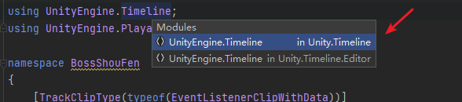
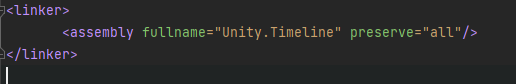
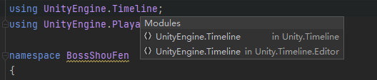
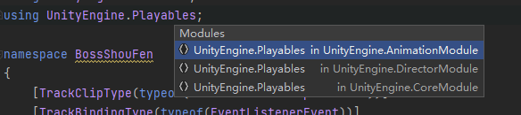
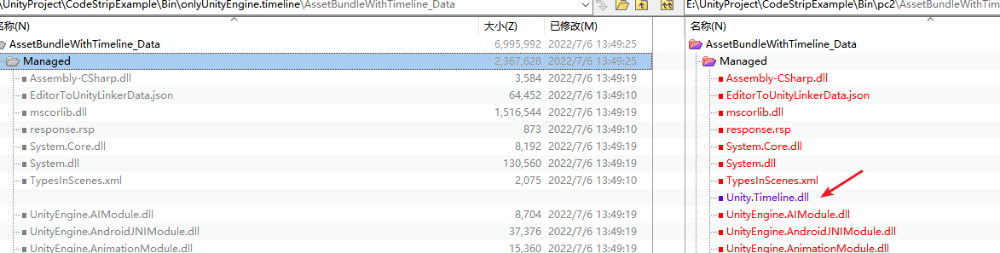
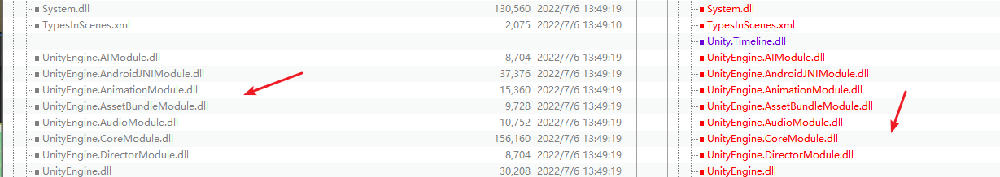
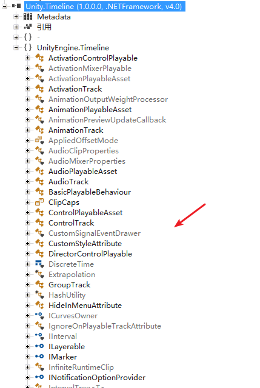

# IOS代码裁剪导致TimeLine动画播放显示异常。
    定位确实有问题，后面发现是Link.xml里面保留的类库名字有问题

    发现TimeLine主要在Unity.TimeLine的dll下面，而不是UnityEngine.TimeLine.dll下面，这个容易弄混。

以后要是遇到其他类似的情况，就先确认对应的类库是否都有，没有被裁减掉，比如:

先在pc端可以验证，对应的dll有没有缺失，可以通过BeyondCompare来看差异

已经有的就先不用动了

用ILSpy反编译Unity.Timeline.dll确定基本都包含了

再验证，基本就没什么问题了。