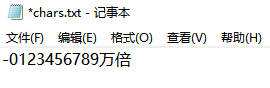
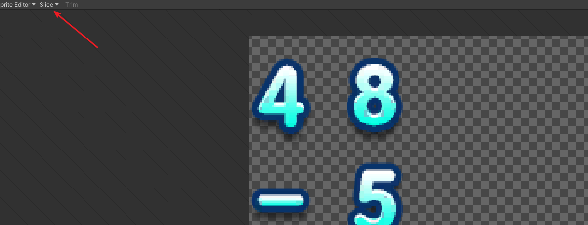
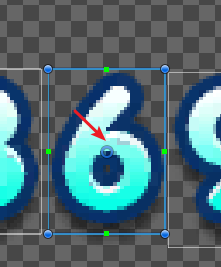

# 自定义图片字体制作
  基于Unity里面的[CustomFont](https://docs.unity3d.com/Manual/class-Font.html),感兴趣的可以去了解下。
  因单个制作过于麻烦,已实现通过插件制作
## 基于散图制作
### 第一种方式

  比如这里有散图(这里的散图的名字可以随便命名),然后右击
  
  这样会出现一个可视化的界面
  
  
  可以看到生成了对应的customfont,这样可以直接在text中使用了
  
### 第二种方式
  就是对应把散图放在想要的文件夹,文件夹名就是之后的字体名，还有就是图片的命名需要是和图片一样的文字（如果不是需要自己手动修改）,像这样：
  
  另外这个文件夹里面除了这些需要使用的自定义字体图片,不能有无关的贴图，不然会有其他问题，然后右击空白处：
  
  
  这样也会自动生成这三个文件:
  
  直接使用也是没有问题的
### 第三种方式
  在散图文件夹新建一个chars.txt的文本文件，里面按照字体的排列顺序在文本里面写上对应的图片文字内容
  
  然后右击
  
  这样也能正常生成和使用

第三种方式也可以配合第一种使用，比如先生成了txt,然后打开gui他会自动匹配，如果想要修改可以直接在gui上改名或者拖动。
一般推荐第一种方式。
## 基于合图制作
  主要考虑到如果只有一张字体合图如何生成对应的字体文件。
  目前也已经实现了插件化操作。就拿刚才生成的字体文件举例。
  删除其他的文件干扰(材质球和customefont),选中字体文件右击：
  
  就会得到这样的三个文件
  
  直接使用的话发现没有显示,那是因为这个合图还需要处理,日志也会有提示
  
  右击这个合图修改他的格式：
  
  可以先改好格式，点击下面的Apply 在打开Sprite Editor，直接打开也没关系，他会提示你是否应用选择apply就行了。
  
  可以发现文字之间确实没有切割，然后点击Slice
  
  点击切割后能看到有切割，需要确认每个字是否都有切割，现在的中心点都在字体的中心，如果有需要调整位置的，调整中心点即可。对于裁剪的不到位的，也可以自己调整。
  
  所有的都分割完毕，点击右上角的Apply 
  
  然后使用还是不能直接用，这是因为命名的问题，没有对应好，需要修改：
  
  点击贴图，打开Sprite Editor
  
  一个个修改，这里面不能直接打出中文字，可以在外面写好粘贴进去，不能重复
  
  都修改完了，点击Apply，然后出来打开贴图就会看到已经一一对应了。
  
  然后右击贴图重新生成一遍就可以了。
  
  
  

# 实现Text渐变色  功能引入
现在的UGUI下的控件Text不支持渐变色,已实现对于Text的渐变色功能
可以直接使用

