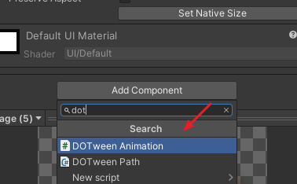
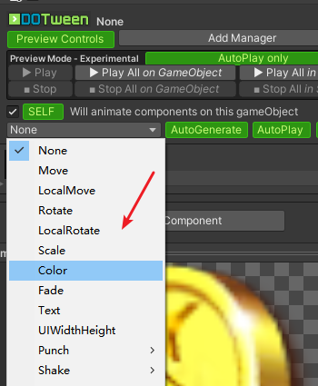
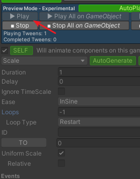
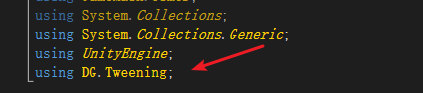
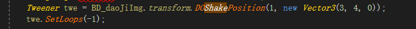

具体的api使用看[官网](http://dotween.demigiant.com/documentation.php)就可以了
# 可视化界面
直接在需要实现动画的组件上面添加动画组件

然后根据需求实现具体的功能

一般实现简单的动画，直接在上面修改参数就可以了。
同时他提供了动画的声明周期函数的绑定回调,需要的话自己实现就可以了。
参数添加完毕直接点Play就可以看到效果。

# 代码实现
    简单实现一个震动的功能
    代码中引入命名空间

