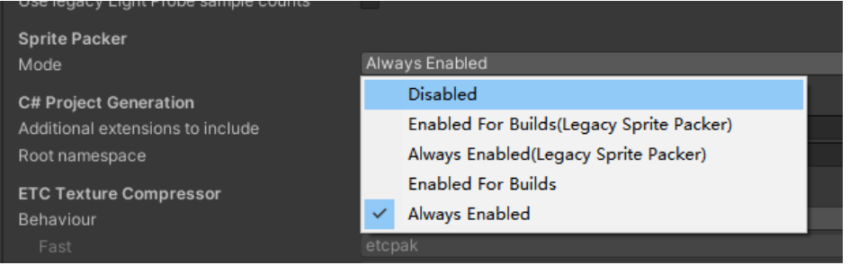
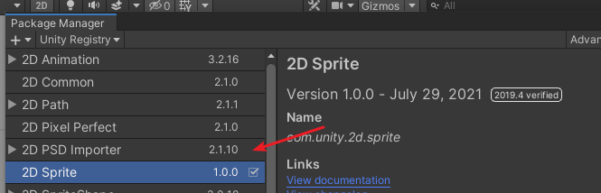
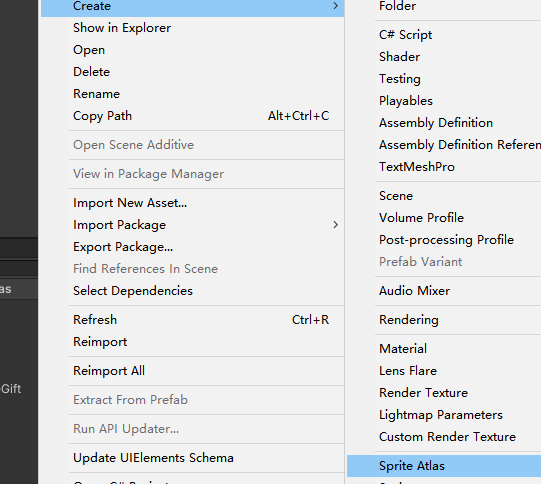
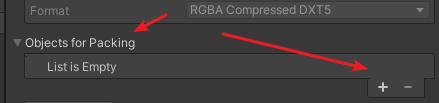
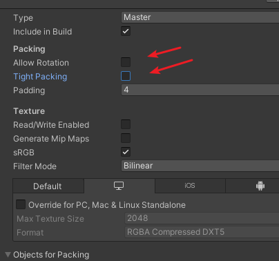

# UGUI下合图的使用 
## 为什么需要使用合图？
  首先是UGUI下面的界面制作是除了背景图和网络下载的图下来的使用RawImage控件，其他的基本都使用Image控件，然后Image的贴图使用的都是Sprite，所以在使用之前记得都要在对应的散图格式修改为Sprite，不然不能使用。
  然后散图过多的话，势必会导致DrawCall的增加,引入Atlas,这样一个合图下面的散图就只会占用一个drawcall。
  具体的图集的制作可以参考[这里](https://docs.unity3d.com/2019.4/Documentation/Manual/class-SpriteAtlas.html)

## 合图的引入
### 打开Project Setting下面的Editor下面的Sprite Packer
  
### 然后取Package Manager下面下载Sprite 2D,等下载好下来导入之后就能使用了。
  
### 然后在对应的文件夹面创建Sprite Atlas
  
  具体的散图的参数就不解释了,直接看官网就可以了。
  添加散图的时候可以主要是用到了Objects for Packing,可以点击 + ，一个个加进去，也可以直接把需要打成合图的散图直接拖进去
  
  散图添加完毕，点击下面的Packpreview就能看到合图了。
  注意，有俩个选项要去掉，因为加上了可能在用散图的时候会有不正确的情况出现。
  

这样合图就算创建好了。在拼界面或者是代码加载的时候只要加载对应的散图就可以了。
打ab包的时候也是只要打散图文件夹就行了，打成的ab里面会是合图资源和他们的引用关系。
后续如果散图文件有变化，只需要重新点击下Pack Preview就可以了。
具体的Atlas和AB包的配合使用，参考[这篇文章](https://www.cnblogs.com/msxh/p/14194756.html)就可以了
~~~
简单来说:
1.SpriteAtlas 勾选Include in build
2.SpriteAtlas不设置AB打包
3.直接当做单Sprite一样加载
~~~

