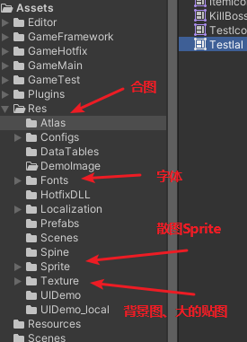
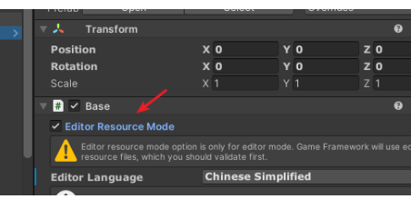
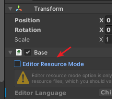
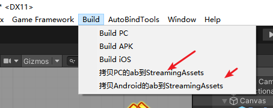
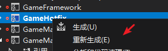
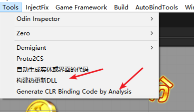
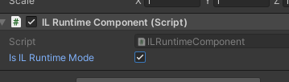
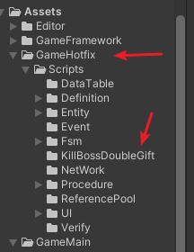
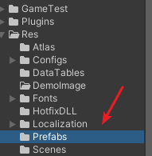

# 界面的制作
## 1.准备工作
  ### 1.参考图(美术提供)    
  ### 2.资源:字体、贴图、粒子、动画、音乐等。
  首先确认这些都拿到了
  ### 3.参考分辨率(一般一开始就定好了)
  这个需要一开始就确定好，美术后面提供的参考图、背景、美术资源都是按照这个分辨率来制作的
  ### 4.文件夹分类
  
  Atlas-新创建的合图都放在这个文件夹下面
  Fonts-所有的字体,名字尽量和美术沟通保持一致，便于后期修改
  Sprite-所有的散图文件,尽量按照功能划分，公共图集也要单独拎出来
  Texture-放一些大的贴图,按照功能划分便于后期查找
## 界面搭建
    1.可以创建一个新的Scene场景,然后把分辨率、相机等参数和主场景保持一致，或者直接从主场景拷贝一个出来，在canvas下面对着参考图拼界面。
    2.日常使用的控件基本UGUI都能够支持,涉及到的主要是脚本绑定UI的脚本。
    这些需要参考动态绑定脚本制作的流程。
[界面UI](https://git.bianfeng.com/gujuntao/rrby2-frontend-v2/-/wikis/UGF%E6%A1%86%E6%9E%B6/UI/%E7%95%8C%E9%9D%A2UI)

[UIDEMO](https://git.bianfeng.com/gujuntao/rrby2-frontend-v2/-/wikis/UGF%E6%A1%86%E6%9E%B6/UIForm/UIDMEO)

## 环境验证
    等界面拼接好了需要验证。
    1.正常先保证编辑器模式下的功能正常

    2.验证非编辑器下的功能是否正常

    这个非编辑器的话需要打ab包，并且吧ab包拷贝到streamingassets下面，现在已经全部实现了插件化操作。
    具体打ab包，[这篇文章](https://git.bianfeng.com/gujuntao/rrby2-frontend-v2/-/wikis/UGF%E6%A1%86%E6%9E%B6/Resource/%E8%B5%84%E6%BA%90Resource)里面已经写过。
    等打包好了，就可以点击拷贝
    
    然后就可以验证了。
    3.非编辑器下的ILRuntime模式下是否正常
    这个模式下需要重编热更工程,打开热更工程，找到gamehotfix,
    
    等重编成功了,然后点击
    
    先拷贝，然后动态分析，同时需要勾选ILRuntimeComponent下面的Il模式
    
    然后就可以验证了。
这样都没问题了界面应该就没问题了。
    新增的脚本按照功能放到Scripts文件夹下面
    
    然后对应的prefab放在res下面
    